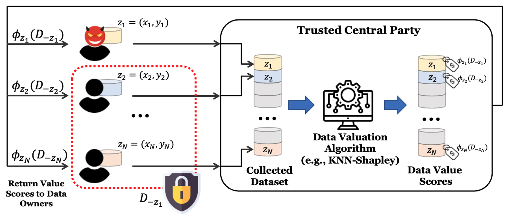

# Threshold KNN-Shapley: A Linear-Time and Privacy-Friendly Approach to Data Valuation

Jiachen T. Wang, Yuqing Zhu, Yu-Xiang Wang, Ruoxi Jia, Prateek Mittal
> 
> Data valuation aims to quantify the usefulness of individual data sources in training machine learning (ML) models, and is a critical aspect of data-centric ML research. However, data valuation faces significant yet frequently overlooked privacy challenges despite its importance. This paper studies these challenges with a focus on KNN-Shapley, one of the most practical data valuation methods nowadays. We first emphasize the inherent privacy risks of KNN-Shapley, and demonstrate the significant technical difficulties in adapting KNN-Shapley to accommodate differential privacy (DP). To overcome these challenges, we introduce TKNN-Shapley, a refined variant of KNN-Shapley that is privacy-friendly, allowing for straightforward modifications to incorporate DP guarantee (DP-TKNN-Shapley). We show that DP-TKNN-Shapley has several advantages and offers a superior privacy-utility tradeoff compared to naively privatized KNN-Shapley in discerning data quality. Moreover, even non-private TKNN-Shapley achieves comparable performance as KNN-Shapley. Overall, our findings suggest that TKNN-Shapley is a promising alternative to KNN-Shapley, particularly for real-world applications involving sensitive data.

<a href="https://arxiv.org/abs/2308.15709"></a>

<p align="center">
  
<br>
</p>

## Description

Official implementation of our NeurIPS 2023 Spotlight paper [Threshold KNN-Shapley: A Linear-Time and Privacy-Friendly Approach to Data Valuation](https://arxiv.org/pdf/2308.15709.pdf), where we propose a new data valuation technique that is **training-free**, has **linear runtime**, and can be **easily modified to provide provable privacy guarantee**. 

If you have any questions related to the code or the paper, feel free to email **Jiachen** (tianhaowang@princeton.edu) and **Ruoxi** (ruoxijia@vt.edu). 

## Quick Start
To reproduce the mislabeled data detection experiments in our paper, we can simply run the following:
```
python main.py --task noisy_detect --dataset 2dplanes --value_type TNN-SV --n_data 2000 --n_val 200 --flip_ratio 0.1 --tau -0.5
```

Here's the naming of `value_type`:
- KNN-SV-RJ: original KNN-Shapley [1].
- KNN-SV-JW: soft-label KNN-Shapley [2]. 
- KNN-SV-RJ-private: naively privatized KNN-Shapley (without subsampling), described in our Appendix B.4. 
- KNN-SV-RJ-private-withsub: naively privatized KNN-Shapley (with subsampling), described in our Appendix B.4. 
- TNN-SV: Threshold KNN-Shapley, described in our Section 4. 
- TNN-SV-private: Private version of Threshold KNN-Shapley, described in our Section 5. 


## Citation

If you use this code in your research, please cite the following work:
```bibtex
@article{wang2023threshold,
  title={Threshold KNN-Shapley: A Linear-Time and Privacy-Friendly Approach to Data Valuation},
  author={Wang, Jiachen T and Zhu, Yuqing and Wang, Yu-Xiang and Jia, Ruoxi and Mittal, Prateek},
  journal={arXiv preprint arXiv:2308.15709},
  year={2023}
}
```

## Reference
[1] Jia, Ruoxi, et al. "Efficient task-specific data valuation for nearest neighbor algorithms." VLDB 2019

[2] Wang, Jiachen T., and Ruoxi Jia. "A Note on" Efficient Task-Specific Data Valuation for Nearest Neighbor Algorithms"." Technical Note (2023).
